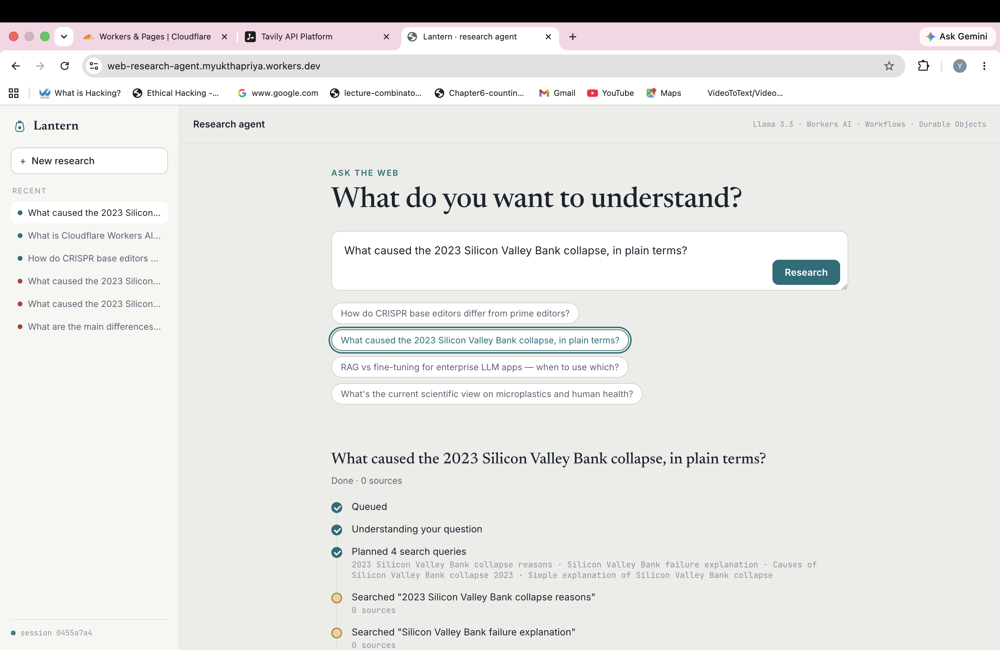
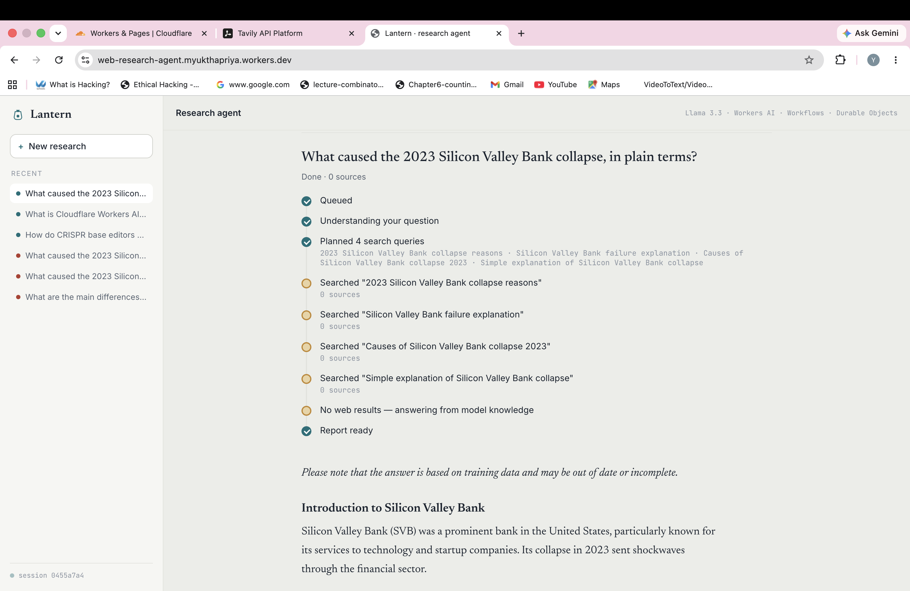
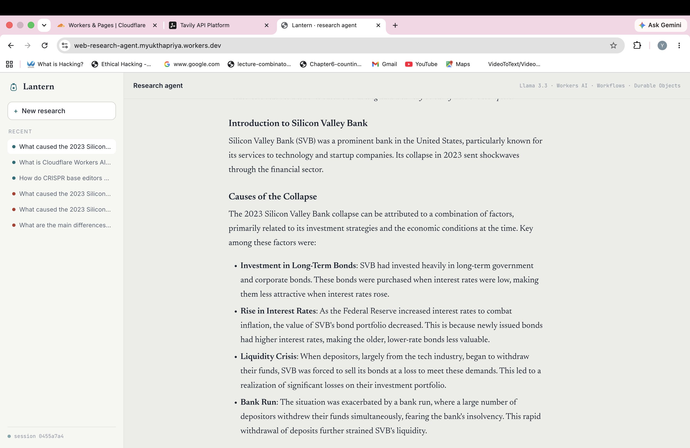
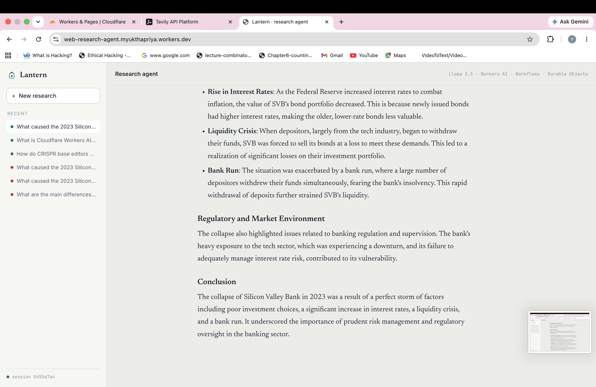

# Lantern — an AI research agent on Cloudflare

**🔗 Live demo: https://web-research-agent.myukthapriya.workers.dev**


## Demo

| | |
|---|---|
|  |  |
|  |  |

---

Ask a question. A Cloudflare **Workflow** breaks it into search queries, searches
the **web**, and uses **Llama 3.3 on Workers AI** to write a short, cited report —
while a live "research trail" streams each step. Every run is saved per‑session in
a **Durable Object**, so your history persists and is isolated to you.

It's built entirely on the Cloudflare developer platform and maps directly to the
four building blocks the assignment asks for:

| Required block            | How it's implemented                                                                 | Where |
| ------------------------- | ------------------------------------------------------------------------------------ | ----- |
| **LLM**                   | Llama 3.3 (`@cf/meta/llama-3.3-70b-instruct-fp8-fast`) on Workers AI, for planning and synthesis | `src/llm.ts` |
| **Workflow / coordination** | Cloudflare Workflows — a durable, multi‑step pipeline (plan → search → synthesize → save) with per‑step retries | `src/workflow.ts` |
| **User input**            | A chat‑style web UI served from the Worker; talks to the API over HTTP               | `public/` |
| **Memory / state**        | An Agents‑SDK Durable Object with embedded SQLite — one instance per session holds the full research history | `src/server.ts` |

---

## How it works

```
Browser (public/)                  Cloudflare Worker (src/server.ts)
┌───────────────┐  POST /api/research    ┌───────────────────────────┐
│  chat UI +    │ ─────────────────────► │  fetch handler (router)   │
│  research     │  GET  /api/research    │                           │
│  trail (poll) │ ◄───────────────────── │                           │
└───────────────┘                        └─────────────┬─────────────┘
                                                        │ RPC
                                          ┌─────────────▼─────────────┐
                                          │  ResearchAgent            │
                                          │  (Durable Object + SQLite)│
                                          │  • per-session history    │
                                          │  • launches the Workflow  │
                                          └─────────────┬─────────────┘
                                                        │ create()
                                          ┌─────────────▼─────────────┐
                                          │  ResearchWorkflow         │
                                          │  durable steps:           │
                                          │   1. plan      (Llama 3.3)│
                                          │   2. search    (Tavily)×N │
                                          │   3. synthesize(Llama 3.3)│
                                          │   4. save  ──► Agent (RPC)│
                                          └───────────────────────────┘
```

1. The browser generates a `sessionId` (stored in `localStorage`) and POSTs a
   question. The Worker routes it to that session's `ResearchAgent`.
2. The Agent inserts a `queued` record into its SQLite and starts a
   `ResearchWorkflow` instance.
3. The Workflow runs durable steps. **Llama 3.3** turns the question into a few
   focused search queries; each query is a **separately retryable** Tavily search;
   then Llama synthesizes a markdown report that cites the sources as `[1]`, `[2]`.
4. After every step the Workflow calls back into the Agent (RPC) to update the
   record. The browser **polls** `GET /api/research?...` and renders the trail and,
   when ready, the report and its sources.

Because each `step.do()` is checkpointed, a flaky search retries on its own without
re‑running earlier steps — so an LLM call or a completed search is never repeated.

---

## Tech stack

- **Workers AI** — `@cf/meta/llama-3.3-70b-instruct-fp8-fast`
- **Cloudflare Workflows** — durable multi‑step execution
- **Agents SDK** (`agents`) — the session Durable Object (SQLite + state)
- **Tavily** — web search built for AI agents (optional; see below)
- **Static assets on Workers** — vanilla HTML/CSS/JS frontend (no build step)
- **TypeScript** + **Wrangler**

---

## Prerequisites

- Node.js 18+ and npm
- A Cloudflare account (the free plan is enough to run this)
- A [Tavily](https://tavily.com) API key — free tier is 1,000 searches/month, no
  card. **Optional:** without it the agent still answers, but from the model's own
  knowledge with a clear "no live sources" disclaimer instead of live web results.

---

## Setup & deploy

```bash
# 1. install
npm install

# 2. authenticate Wrangler with your Cloudflare account
npx wrangler login

# 3. add your Tavily key as a secret (skip to run without live web search)
npx wrangler secret put TAVILY_API_KEY
#   paste your tvly-... key when prompted

# 4. deploy
npm run deploy
```

Wrangler prints your live URL (e.g. `https://web-research-agent.<subdomain>.workers.dev`).
The first deploy provisions the Durable Object migration and the Workflow
automatically. Open the URL and ask a question.

## Local development

```bash
# put your key in .dev.vars for local runs (see .dev.vars.example)
echo "TAVILY_API_KEY=tvly-your-key" > .dev.vars

npm run dev
```

`wrangler dev` runs the Worker, Durable Object, and Workflow locally. Workers AI
calls are proxied to your Cloudflare account, so `npx wrangler login` is required
and inference counts against your account's Workers AI usage.

Type‑check without deploying:

```bash
npm run typecheck
```

---

## Project structure

```
web-research-agent/
├── wrangler.jsonc        # bindings: AI, Durable Object, Workflow, static assets
├── src/
│   ├── server.ts         # Worker entry + ResearchAgent (Durable Object, memory + API)
│   ├── workflow.ts       # ResearchWorkflow: plan → search → synthesize → save
│   ├── llm.ts            # Llama 3.3 helpers (planning + cited synthesis)
│   ├── search.ts         # Tavily web search (+ graceful no-key fallback)
│   └── types.ts          # shared types and the Env binding interface
└── public/
    ├── index.html        # chat UI
    ├── styles.css        # "reading room" theme
    └── app.js            # session, polling, trail + report rendering
```

---

## Notes & limitations

- **Session identity** is a `localStorage` UUID passed to the API; anyone with a
  session id could read that session's history. For a real product, put the agent
  behind authentication and derive the session from the signed‑in user.
- **Polling** (every ~1.2s) is used instead of WebSockets to keep the client
  dependency‑free and robust. The Agents SDK also supports live state over a
  WebSocket if you want push updates.
- **Report quality** depends on what search returns; the prompt tells the model to
  rely only on retrieved sources and to say when they're thin or conflicting.

## Possible extensions

- Stream the synthesis token‑by‑token over the Agents SDK WebSocket.
- Add a follow‑up turn so a session becomes a real research conversation.
- Swap Tavily for Brave Search, or add Cloudflare Browser Rendering to read full
  pages for deeper extraction.
- Cache identical questions in the Durable Object to skip repeat work.
